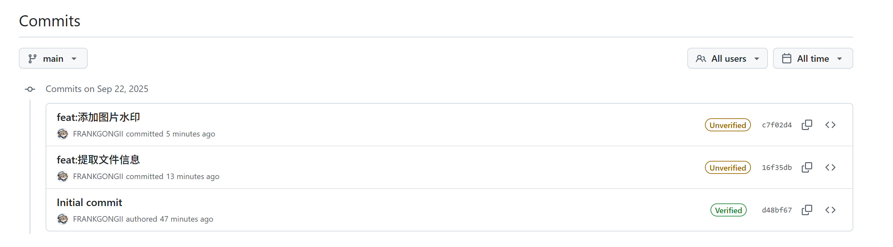
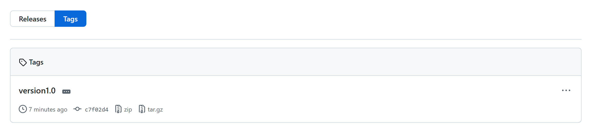

# HW1
git地址：<https://github.com/FRANKGONGII/ai_helping_coding_hw1.git>

## 程序效果
+ 命令格式
  `python watermark_step1.py photo_dic_name watermark_size watermark_color watermark_pos`
+ 测试：执行命令`python watermark_step1.py ./photos 100 "#FF0000" right-bottom`
  + 原图：
    
  + 添加水印：
    

## git提交
+ 可以看到有两个提交，组合起来实现了需求的功能
  
+ 最后生成了一个tag
  

## 太乙平台暂时注册不了，没有学籍号